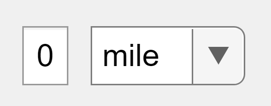

# Unit Converter Component

Version: 1.0

Converts input into a standardized unit.



## Syntax
Note: A conversion table containing units and conversion factors is used. The conversion factors are taken from [Wikipedia](https://en.wikipedia.org/wiki/Conversion_of_units#Length). The conversion works by converting from the `DisplayUnit` to the standard unit for the table, then to the `TargetUnit`.
<details><summary>Click to view the default conversion table (relative to meters)</summary>

| RowNames | ConversionFactors |
| ------ | ------ |
| mile | 1609.344 |
| foot | 0.3048 |
| inch | 0.0254 |
| meter | 1 |
| yard | 0.9144 | 

</details>

- `unitConverterComponent(parent)` creates a unit converter in the specified parent container. The parent can be a figure or one of its child containers.
- `unitConverterComponent('TargetUnit', Unit)` - specifies the target unit that the input values are converted to, containing a dropdown and numeric edit field. Use this option with any of the input argument combinations in the previous syntaxes.
- `unitConverterComponent(_, Name, Value)` - creates a unit converter with properties specified by one or more name-value arguments.

This information is also available if you call `help unitConverterComponent`.

## Name-Value Pair Arguments/Properties
- `DisplayUnit` (1 x 1 text) - the unit the app user passes in through the dropdown. The list of units from which the app user can select as the `DisplayUnit` is determined by the row names of units in the conversion table.
- `DisplayValue` (double) - the number of the specified unit the app user passes in through the numeric edit field.
- `TargetUnit` (1 x 1 text) - the unit the app author chooses to do conversions into.
- `Value` (double) - the final converted value in the target unit.
- `ConversionTable` (n x 1 table)- the conversion table used to determine the units supported and their respective conversion factor. It must contain row names of `n` units with the first column being conversion factors into the `TargetUnit`. The conversion factors into a specified unit may not neccesarily be the `TargetUnit`. 
- `FontSize` (double) - the font size of the text box and dropdown.
- `FontName` (must be a member of available system fonts in `listfonts`) - the font used for the text box and dropdown.
- `FontColor` (1 x 3 RGB triplet) - the color of the text in the edit field.
- `BackgroundColor` (1 x 3 RGB triplet) - the background color of the edit field.
- `TextFieldLayout` (`'side-by-side' or 'stacked'`) - the position of the edit field and the dropdown.

## Method
- `makeDefaultConversionTable(obj)` - Resets the conversion table to the default one.

## Example
View the `example.mlapp` file for more examples. This app shows the converted value based on the user's input.

Let's say there is an app author trying to create an app that collects different distances in a physics experiment and compile them into a dashboard. If it has an international audience, it may collect data in the form of 'meters' or 'kilometers', or for the U.S, in 'feet', 'miles', and perhaps even 'yards'. In other words, there are many different units an app user may wish to input. To standardize the data and make it easier for comparison by the app author, the component can be used.

```
unitConverterComponent('TargetUnit', 'mile')
```

Now, all values entered into the component will be converted to miles for only the app author to see.

To export the component into App Designer, run the following in the Command Window ([instructions](https://www.mathworks.com/help/matlab/creating_guis/custom-ui-component-classes-in-app-designer.html) under 'Configure Custom UI Component'):
```
appdesigner.customcomponent.configureMetadata('C:\MyComponents\unitConverterComponent.m'); % insert your file path
```


